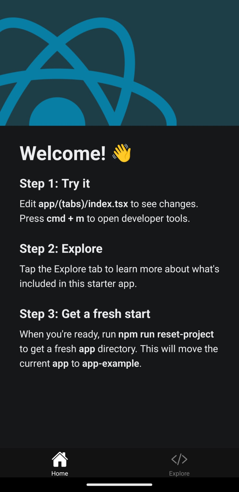
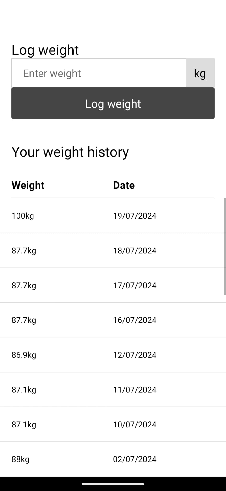

- [What we're going to work on](#what-were-going-to-work-on)
- [Creating a new React Native project](#creating-a-new-react-native-project)
- [Building the app](#building-the-app)
  - [Setting up](#setting-up)
  - [Homepage](#homepage)
  - [Log in screen](#log-in-screen)
    - [Form validation](#form-validation)
    - [Sending a request to our API](#sending-a-request-to-our-api)
    - [Handling loading and error states](#handling-loading-and-error-states)
    - [Storing our session token](#storing-our-session-token)
    - [Post authentication steps](#post-authentication-steps)
  - [Dashboard screen](#dashboard-screen)
    - [Creating our own \<Button\> component](#creating-our-own-button-component)
  - [Log weight screen](#log-weight-screen)
    - [Building the form](#building-the-form)
    - [Listing previously logged weights](#listing-previously-logged-weights)
  - [Adding a log out button](#adding-a-log-out-button)
- [Conclusion](#conclusion)

## What we're going to work on

As mentioned in [part three](/writing/2024/07/building-a-fitness-app-with-java-part-3), we're going to start building the mobile app using React Native.

I decided to use React Native as it's something I've recently (around a month and a half) been introduced to at work and I thought it would be a good way to develop those skills further. I found the developer experience for React Native really nice, and I can use tools/languages I'm already familiar with (JS/TS/CSS/etc.).

It's worth mentioning at this point - **I am by no means an expert in RN development**, everything you see in this post is the result of reading the documentation and trial and error 🙂 The initial version is probably not going to be great, but over time (in future posts) I'll refactor and improve it.

## Creating a new React Native project

When I was building our app at work, I wrote down the steps I used to initialise my project, so I can just repeat those again. 

To create a React Native app, you use something called [Expo](https://expo.dev/) (recommended by the React Native team). As far I've as understood, it's a framework with a lot of stuff built-in which you'd otherwise have to build/setup yourself (file-based routing and TypeScript integration as two examples), has a bunch of useful libraries (`expo-image`, `expo-font`, etc.) and probably lots more things that I'll discover as I go along.

I initially tried creating a RN app without Expo when exploring the technology, and the difference in experience between bare RN and Expo was huge.

First let's create the app:

```bash
npx create-expo-app@latest <app_name> --template https://github.com/expo/expo-template-default
```

Then run the `expo prebuild` command:

```bash
npx expo prebuild --template https://github.com/expo/expo/tree/main/templates/expo-template-bare-minimum
```

This generates the directories (`ios`/`android`) where the native code lives. 

Normally you wouldn't run this manually, you'd just run `npx expo run android`, which would execute `expo prebuild` as part of its initialisation process, however that didn't work for me, so I had to run it manually.

To run it, you'll either need an emulator created through Android Studio, or a physical device connected via USB/WiFi. I connect through WiFi by enabling wireless debugging on my Android phone (Pixel 5) and connecting with the following (the port can be found under "Wireless Debugging"):

```bash
adb connect 192.168.0.6:random_generated_port
```

Then you can start the app like so:

```
npx expo run android
```

This will take a while, but eventually you'll need greeted with the Expo example app on your phone:



## Building the app

Before we write any code, we'll install `expo-dev-client` to [add a developer menu](https://docs.expo.dev/versions/latest/sdk/dev-client/):

```bash
npx expo install expo-dev-client
```

At this point we have an application flow, and the backend APIs each screen will call, but we have no visual design for the app yet. As I go along I'm going to create a wireframe for each screen using a pen and paper.

I debated creating mockups, but don't feel like learning any design tools at the moment - in the past I've used Sketch/Adobe Illustrator. The former is Mac only, and the latter carries a subscription fee.

### Setting up

First we need to get rid of the example code added by Expo, we can do that by running:

```bash
# Move all of the example code into 'app-example'
npm run reset-project

# Remove 'app-example'
rm -rf ./app-example/ 
```

Now we can start writing code.

### Homepage

The "homepage" of our app will serve do a few things:
- If the user is not logged in, show them a welcome screen, with buttons to log in/sign up
- If the user is logged in, send them to their dashboard to start logging things

Let's write a screen:

```jsx
import Box from "@/components/layout/Box";
import ScreenLayout from "@/components/layout/ScreenLayout";
import Heading from "@/components/text/Heading";
import { router } from "expo-router";
import { Button, Text } from "react-native";

export default function HomepageScreen() {
    return (
        <ScreenLayout screenHasHeader={false}>
            <Box padding={20}>
                <Heading>Welcome to Fitness Tracker App!</Heading>
                <Text>This section will describe in a few words what you can do on this app.</Text>
                <Text>To get started, either log in or sign up:</Text>
            </Box>
            <Box flex={1} padding={20} clampChildrenToBottom>
                <Button title="Log in" onPress={() => router.navigate("/auth/log-in")} />
                <Button title="Sign up" onPress={() => router.navigate("/auth/sign-up")} />
            </Box>
        </ScreenLayout>
    );
}
```

This is very simple, we did a few things:
- Created a `<ScreenLayout>` component which will wrap every screen in our app. I did this so I could set the background colour consistently and also depending on the context, wrap the screen in either a `<View>` or a `<SafeAreaView>` (when used with a navigation stack).
- Created a `<Box>` component which we use for laying out different sections on the page, rather than wrapping everything in individual `<View>` components. The props are things which you commonly set for layout - `padding`, `margin`, `flex`, etc.
- Created a `<Heading>` component which we will use for headings. In the future if we decide to add themes, we can change the font styles/colours in here.

We use native buttons for now with inline event handlers, later on we'll create our own `<Button>` component which is wrapped in `expo-router`s `<Link>` component.

### Log in screen

The log in screen's sole purpose is to authenticate the current user and obtain a session token for use later on. This screen is interesting as we'll need to implement a few things:
- Form validation
- Sending a request to our API
- Handling loading and error states
- Storing our session token
- Post authentication steps

#### Form validation

Whilst we could write our forms and validation from scratch, I'm going to make use of [React Hook Form](https://react-hook-form.com/) instead. I'm familiar with how it works and it will allow us to keep moving quickly.

Let's install it:

```bash
npm install --save react-hook-form
```

Then let's write an empty `LoginForm` component:

```jsx
import { Text } from "react-native";

export default function LogInForm() {
    return (
        <Text>Form goes here</Text>
    )
}
```

To implement a form we'll first need to create our form type:

```ts
type LoginForm {
    email: string
    password: string
}
```

Then we'll need to call React Hook Form's `useForm` hook ([as described in their docs](https://react-hook-form.com/get-started#ReactNative)):

```ts
const { 
    control, 
    handleSubmit,
    formState
} = useForm<LoginForm>({
    mode: "all",
    defaultValues: {
        email: '',
        password: ''
    }
});
```

There's 3 properties we're interested in: `control` (needed for `<Controller>`), `handleSubmit` (which we'll call from our button) and `formState`, which as the name implies will allow us to get hold of any errors and whether the form is valid or not.

Then we create our input like so:

```jsx
<View>
    <Text style={{}}>Email address</Text>
    <Controller 
        control={control}
        name="email"
        rules={{
            required: 'Please enter an email address'
        }} 
        render={({ field: { onChange, value } }) => (
            <TextInput 
                value={value}
                onChangeText={onChange}
                style={{}}
            />
        )}
    />
    {errors.email ? <Text style={{}}>{errors.email.message}</Text> : null}
</View>
```

Next we need to add some styling. My first thought was to create components for each aspect of the form (label, input, errors), but I think a simpler approach for now is to create some global styles (in `styles.ts`) and use them in the `style` attribute of our components. We can always create components later on when we've got a better idea how they will be used in our app.

We create some global styles like this:

```ts
export const formStyles = StyleSheet.create({
    label: {
        marginBottom: 8
    },
    input: {
        borderWidth: 1,
        borderColor: '#CCC'
    }
});
```

And use them like this:

```jsx
<Text style={formStyles.label}>My form label</Text>
```

I'm not sure if styling this way is the preferred approach (I didn't do any research yet), the only other method I could think of is wrapping your components in other components whose sole responsibility is to style them (e.g. `<Heading>`, `<Label>`).

Finally we write our submit button:

```jsx
<Button title="Log in" onPress={handleSubmit(handlePressLogInButton)}/>
```

This calls React Hook Form's `handleSubmit` function when pressed which will trigger form validation. If the form is valid, then it calls our function `handlePressLogInButton`, which is where we'll add the logic to actually log in.

The only thing that's left to do is add email validation to the email address field:

```jsx
<Controller 
    // ...
    rules={{
        required: 'Please enter an email address',
        pattern: {
            // <something>@<something>.<tld>
            value: /.+@.+\..+/,
            message: 'Please enter a valid email address'
        }
    }} 
    // ...
/>
```

That's validation done - next we need to send the request to our API.

#### Sending a request to our API

In order to send a request to our API we'll need to write:
- A request/response type for our function
- A function that sends a login request to our API

For this I'm just going to use plain old `fetch` (maybe later on I'll refactor to use `react-query`) to keep things simple.

Our request/response types look like this - I'm not 100% sure this is the right way to model these types
with TypeScript.

```ts
type LoginRequest = {
    email: string,
    password: string
}

type ValidationError = {
    field: string,
    message: string
}

type ValidationErrorResponse = {
    errorCode?: ErrorCode,
    validationErrors?: ValidationError[]
}

type InvalidCredentialsResponse = {
    errorCode?: ErrorCode
}

type LoginSuccessResponse = {
    success?: boolean,
    sessionToken?: string
}

// Possible results:
// - Validation errors
// - Invalid email/password
// - Success!
type LoginResponse = LoginSuccessResponse & InvalidCredentialsResponse & ValidationErrorResponse;
```

And our function looks like this:

```ts
export async function login(request: LoginRequest): Promise<LoginResponse> {
    try {
        const response = await fetch(`${API_BASE_URL}/auth/login`, {
            method: 'POST',
            headers: {
                'Content-Type': 'application/json',
            },
            body: JSON.stringify(request)
        });

        const json = await response.json();

        // Extract the session token if the login request succeeded
        if(json.success) {
            const sessionToken = response.headers.get('X-Auth-Token');
            if (sessionToken) {
                json.sessionToken = sessionToken;
            }
        }

        return json;
    } catch (e) {
        return {
            success: false
        }
    }
}
```

We intentionally do not check `response.ok` as validation/server errors return a non-OK status, and we'd like them to be converted to JSON. We handle all `fetch` exceptions the same way - later on we may handle these cases differently (e.g. network down), but for now this is fine.

> **Side note**: We are not handling request timeouts here either - we'll add that later on.

Then we can call it in our component like so:

```ts
async function handlePressLogInButton() {
    console.log('Logging in - valid? ', isValid);

    const { success, errorCode, sessionToken } = await login(getValues());
    if (!success) {
        console.log('Failed to login', errorCode);
        return;
    }

    console.log('Login success!', sessionToken);
}
```

This works great! The only problem is that when we press the submit button there's no loading state, and we also do not tell the user that their credentials are incorrect if the request failed - let's do that next.

#### Handling loading and error states

The easiest way to deal with these are to create some state variables stored in React state (`useState`):

```ts
const [loading, setLoading] = useState<boolean>(false);
const [authError, setAuthError] = useState<ErrorCode | null | undefined>();
```

Then in our event handler, set them appropriately:

```ts
async function handlePressLogInButton() {
    console.log('Logging in - valid? ', isValid);

    setAuthError(null);
    setLoading(true);
    
    const { success, errorCode, sessionToken } = await login(getValues());
    if (!success) {
        console.log('Failed to login', errorCode);
        setLoading(false);
        setAuthError(errorCode);
        return;
    }

    console.log('Login success!', sessionToken);
    setLoading(false);
}
```

Finally, we can update our component to display a loading indicator when the request is in progress:

```jsx
{
    loading ? 
    <ActivityIndicator size={32} /> :
    <Button title="Log in" onPress={handleSubmit(handlePressLogInButton)}/>
}
```

And display an error message if it fails...

```jsx
{
    authError ?
    <FieldErrorMessage fieldError={{type: authError, message: 'Invalid credentials'}} /> :
    null
}
```

Next we need to store our session token so it can be used later on.

#### Storing our session token

In React Native apps there are two different places we can store data:
- Secure storage, ...
- Async storage, ...

Because the session token is sensitive, we'll store it in secure storage.

First we'll need to install it:

```bash
npx expo install expo-secure-store
```

Now we could just update our `handlePressLogInButton` function to save this value:

```ts
import * as SecureStore from 'expo-secure-store';

SecureStore.setItemAsync('sessionToken', 'our-session-token');
```

Then later on when we need it:

```ts
SecureStore.getItemAsync('sessionToken');
```

The problem with this is that each time we need to use this value, we'll either need to copy and paste this line, or fetch it once in the top-most component, then pass `sessionToken` as a prop through all our components (aka prop drilling.) 

A better way to do this would be to store this value in a `React` context, then each child compoonents that needs access to it can just grab it, and child components that need to set it can just call the setter function. It would look something like this:

```jsx
// In our top-level component (the thing that wraps the whole app)

function RootLayout() {
    // We could also use getItemAsync inside a useEffect
    const token = SecureStore.getItem('sessionToken');
    const [sessionToken, setSessionToken] = useState(token);

    <AuthContext.Provider value={[sessionToken, setSessionToken]}>
        {/* Other components */}
    </AuthContext.Provider>
}
```

Then in a child component that needs to set it (e.g. our log in form):

```jsx
function LogInForm() {
    const [sessionToken, setSessionToken] = useContext(AuthContext);

    // Do auth request
    // ...

    setSessionToken('our-new-token');
}
```

And in a child component that needs to access it:

```jsx
function AnotherComponent() {
    const [sessionToken] = useContext(AuthContext);

    requestWhichRequiresSessionToken(sessionToken);
}
```

Using this method, child components can easily access the session token.

This approach works just fine and requires no additional libraries (context is a part of React). However I can forsee more than just the session token being needed throughout the app (for example, the authenticated user's details), so at this point I'm going to reach for a state-management library - [Zustand](https://github.com/pmndrs/zustand) to simplify things.

The reason I chose Zustand is that I have used it on another project, so it's familar, and it has a really cool feature where it can automatically persist your state to some persistent storage, without needing to make that call manually - in our case we wouldn't need to manually save the session token to secure storage, we could simply set its value in a zustand store, and it will automagically persist it.

First let's install it:

```bash
npm i zustand
```

Then we'll create our first store, first we'll need to define our state that will be stored and functions that will manipulate said state:

```ts
export type AuthState = {
    sessionToken: string,
    saveSessionToken: (sessionToken: string) => void,
    logOut: () => void
}
```

Next we'll create a store that uses this:

```ts
export const useAuthStore = create(
    persist<AuthState>(
        (set) => ({
            sessionToken: '',
            saveSessionToken: (sessionToken: string) => {
                set({ sessionToken });
            },
            logOut: () => {
                set({
                    sessionToken: ''
                });
            }
        }),
        // Persist the state as JSON in SecureStore
        {
            name: 'auth-storage',
            storage: createJSONStorage(() => secureStoreStorage)
        }
    )
);
```

This is pretty simple, in the store you implement any methods that are defined in your state, and the bottom part defines how our state should be stored - in our case the state will be serialised to JSON, then saved in SecureStore.

Zustand doesn't come with this functionality out of the box, but it does provide an interface that you can implement, so that's what we did - in the above example `secureStoreStorage` is defined like this:

```ts
const secureStoreStorage: StateStorage = {
    getItem: async function (name: string) {
        return await SecureStore.getItemAsync(name);
    },
    setItem: async function (name: string, value: string) {
        return await SecureStore.setItemAsync(name, value);
    },
    removeItem: async function (name: string) {
        return await SecureStore.deleteItemAsync(name);
    }
}
```

As long as your object conforms to the interface, Zustand will be able to use it to persist state. This is really flexible, and I was quite surprised how easy it was to implement this.

Finally, we can now use Zustand to save our session token, let's update `LogInForm`:

```jsx
function LogInForm() {
    const saveSessionToken = useAuthStore(state => state.saveSessionToken);

    // Later on..
    saveSessionToken('our-session-token');
}
```

And that's it! Our session token will now be persisted in secure storage and other components that need it will be able to retrieve it like this:

```ts
const sessionToken = useAuthStore(state => state.sessionToken);
```

Simple!

####  Post authentication steps

The final part of this form is doing something when authentication is successful, in our case, we'd like to send them to the dashboard screen.

We could implement this directly in `LogInForm`, by hard-coding this line after authentication succeeds:

```ts
router.replace('/dashboard');
```

However this means we won't be able to use `LogInForm` anywhere else - for example, we may want the user to re-authenticate when doing something sensitive in their account. To get around this, we should leave the decision of what to do after authenticating, to the parent component that includes the form.

Let's give our `LogInForm` a new prop:

```ts
type LoginFormProps = {
    onAuthSuccess: () => void
}
```
And update the parent component to do something with that:

```jsx
function handleAuthSuccess() {
    router.navigate('/dashboard');
}

<LogInForm onAuthSuccess={handleAuthSuccess} />
```

Now our `LogInForm` component can be used elsewhere.

### Dashboard screen

The dashboard will be fairly simple - for now it will have 2 sections, one for start a workout and the other will be to log your weight. Eventually the dashboard will contain stats (last workout, weight progress, etc), but for this initial version, we'll keep it simple:

```jsx
export default function DashboardScreen() {
    return (
        <ScreenLayout screenHasHeader={false}>
            <Box flex={1} padding={20}>
                <Heading>Log workout</Heading>
                <Text>Here you can log your workout</Text>
            </Box>
            <Box flex={1} padding={20}>
                <Heading>Log weight</Heading>
                <Text>Here you can log your weight</Text>
            </Box>
        </ScreenLayout>
    )
}
```

#### Creating our own &lt;Button&gt; component

Next we need to add some buttons which link to other sections. On the homepage, we used React Native's `<Button>` component with an `onPress` to navigate between pages, let's improve that by creating our own button component:

```jsx
type ButtonProps = {
    title: string,
    onPress?: () => void,
    href?: string
}

export default function Button({ href, title, onPress = () => {} }: ButtonProps) {
    // If there's an href, wrap with expo-router's <Link> component to navigate.
    if(href) {
        return (
            <Link 
                href={href} 
                style={styles.buttonContainer} 
                asChild>
                <Pressable>
                    <Text style={styles.buttonText}>
                        {title}
                    </Text>
                </Pressable>
            </Link>
        )
    }

    // Otherwise use a <Pressable> with onPress
    return (
        <Pressable style={styles.buttonContainer} onPress={() => onPress()}>
            <Text style={styles.buttonText}>
                {title}
            </Text>
        </Pressable>
    )
}
```

It's still missing a lot of functionality - different button styles (primary, secondary, muted, disabled, etc) and an active/pressed state but will do for now as it lets us either navigate between pages, or execute a callback when pressed.

We can use it like this:

```jsx
// To navigate to another view
<Button title="Click me" href="/my-page" />

// To execute some code
<Button title="Click me" onPress={() => console.log('Clicked!')} />
```

And that's it for the dashboard, for now it's very unremarkable, and just serves as a hub to access other functionality.

### Log weight screen

The purpose of this screen is for the user to log their weight for today. We need to build a few things for this screen:
- A form to enter the weight
- A list of previous logged weights - this wasn't in my original plan, but I thought I'd add it for the initial version.

#### Building the form

We can use our login page for inspiration here, we need to do the following:
- Define the form model
- Create the input fields
- Create the submit button
- Write the event handler that gets called when you press the submit button


Let's write a form model:

```ts
type LogWeightForm = {
    weight: number
}
```

...and an input field/submit button

```jsx
<View>
    <Controller 
        control={control}
        name="weight"
        rules={{
            required: 'Please enter a weight'
        }} 
        render={({ field: { onChange, value } }) => (
            <View>
                <TextInput 
                    value={value?.toString()}
                    onChangeText={onChange}
                    style={formStyles.input}
                    placeholder="Enter weight"
                    keyboardType="number-pad"
                />
                <Text style={styles.inputUnitType}>kg</Text>
            </View>
        )}
    />
    <FieldErrorMessage fieldError={errors.weight} />
</View>

/// ...

<Button title="Log weight" onPress={handleSubmit(handlePressLogWeightButton)} />
```

Then finally, let's write the event handler that gets called when we press the button, and hook it up to our API call:

```ts
async function handlePressLogWeightButton() {
    setLoading(true);

    const weight = getValues().weight;
    const { success } = await logWeight({
        sessionToken,
        weight
    });

    setLoading(false);

    if(success) {
        setComplete(true);
    }
}
```

Pretty simple stuff - set a loading state when the button is pressed, call the API, hide the loading state and finally if the request was successful, set the `complete` field to `true` so we can update the UI telling the user their weight was logged.

#### Listing previously logged weights

Before we can build this feature, we'll need to go back to our backend and write an endpoint that lists weights for a user.

The controller looks like this:

```java
@GetMapping("/api/v1/user/weight/")
public ResponseEntity<ApiResponse> listBodyWeight(@AuthenticationPrincipal User user) {

    var bodyWeights = userBodyWeightService.findAll(user);

    return ResponseEntity.ok(new ListBodyWeightResponse(bodyWeights));
}
```

The service/DAO are straightforward enough that they don't need to be posted (all they do is list bodyweight from the database).

Now let's update our screen to use this data.

First we'll need to create some state to hold the body weight records in:

```ts
const [bodyWeights, setBodyWeights] = useState<UserBodyWeight[]>()
```

Then we'll need to fetch it in a `useEffect` hook and set that state (`listBodyWeight` always returns a list):

```ts
useEffect(() => {
    (async () => {
        const { bodyWeights } = await listBodyWeight({ sessionToken });
        setBodyWeights(bodyWeights);
    })();
}, []);
```

And finally we'll need to display it (for now I just log the count):

```jsx
<Box flex={1} padding={20}>
    <Heading>Weight history</Heading>
    <Text>{bodyWeights?.length}</Text>
</Box>
```

> **Side note** I (and you, probably) may have noticed this screen is getting quite large at this point, we'll refactor this shortly.


Let's try it out! Hmmm, it doesn't work yet - we get an error message on our server:

```
com.fasterxml.jackson.databind.exc.InvalidDefinitionException: Java 8 date/time type `java.time.LocalDate` not supported by default: add Module "com.fasterxml.jackson.datatype:jackson-datatype-jsr310" to enable handling
```

This is because our model contains a `LocalDate`, and Jackson does not know how to convert that into JSON. Let's get that fixed.

First we need to add the dependency:

```xml
<dependency>
    <groupId>com.fasterxml.jackson.datatype</groupId>
    <artifactId>jackson-datatype-jsr310</artifactId>
    <version>2.17.2</version>
</dependency>
```

Then we need to enable it:

```java
@Bean
public ObjectMapper objectMapper() {
    var objectMapper = new ObjectMapper();
    // ...
    objectMapper.registerModule(new JavaTimeModule());
    // ...
    return objectMapper;
}
```

Then we need to tell Jackson how we want our `LocalDate` serialised:

```java
@JsonFormat(shape = JsonFormat.Shape.STRING, pattern = "dd/MM/yyyy")
private LocalDate loggedOn;
```

We do the date formatting on the server because:
- We don't need i18n for our app
- Our app can just use the value as-is, without needing to perform any formatting before displaying it

It works! The app displays `1` as the length of `bodyWeights` and when I print out the date, it displays `19/07/2024`.

I then updated my migration script to include some historical body weights for myself, so we can see how this screen behaves when there are lots of records.

Now let's update the view so the weights display in a scrollable list:

```jsx
<Box>
    <Box padding={20}>
        <Heading>Your weight history</Heading>
    </Box>

    <View style={styles.listHeadingContainer}>
        <Text style={styles.listHeading}>Weight</Text>
        <Text style={styles.listHeading}>Date</Text>
    </View>
    {
        bodyWeights?.length ?
        <FlatList
            data={bodyWeights}
            keyExtractor={(item) => {
                return item.id.toString()
            }}
            renderItem={({ item }) => {
                return (
                    <View style={styles.listItem}>
                        <Text style={styles.listItemDataWeight}>{item.weight}kg</Text>
                        <Text style={styles.listItemDataLoggedOn}>{item.loggedOn}</Text>
                    </View>
                    
                )
            }}
        />:
        <Text>You haven't logged any body weights yet.</Text>
    }
</Box>
```
This is pretty straightforward, we display our list of items in a `FlatList` and now our screen looks like this:



I think that will do for this screen for now.

### Adding a log out button

We currently don't have a way to log out from our app - let's write that now.

On the dashboard we'll add a button, and hook it up to an event handler:

```jsx
<Button title="Log out" onPress={handleLogOut} />
```

```ts
const auth = useAuthStore();

function handleLogOut() {
    auth.logOut();
    router.navigate('/');
}
```

The `logOut` function is from our auth store, all it does it deletes the session token that's stored on the device.

And that's it! Pressing the button takes us back to the homepage.

## Conclusion

We've got a lot accomplished in this post, we've scaffolded our React Native app, wrote the homepage, dashboard and log weight screens and got our app communicating with our API. Although our app doesn't look the greatest (and there's lots of room for improvement in the code), we can improve that later on.

I created a quick video [here](https://youtube.com/shorts/lPdj9vlc-us?feature=share) which demonstrates everything I've built so far, and how the app looks like. The video is very low quality as it was screen recorded on my phone, then sent through WhatsApp.

In the next part, we'll begin work on the main part of the app: the log workout screen - this is where you'll enter your exercise, sets, reps, weight, etc and is the main function of the app.

[Bye for now](https://www.youtube.com/watch?v=JgFvNzLAWtY)