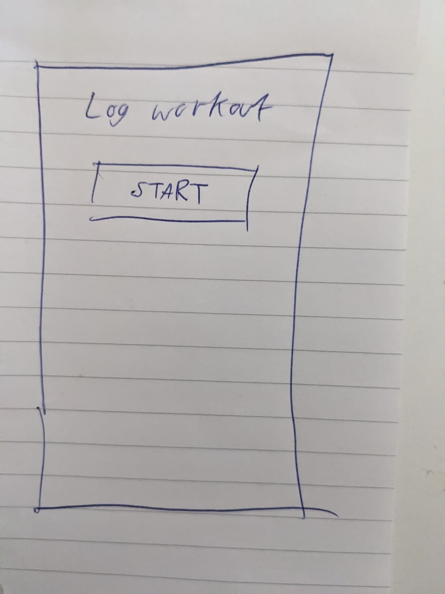

- [What we're going to work on](#what-were-going-to-work-on)
- [Planning](#planning)
- [Building screens](#building-screens)
  - [Layout](#layout)
  - [Initial screen](#initial-screen)
  - [Select exercise screen](#select-exercise-screen)
  - [Workout exercise screen](#workout-exercise-screen)
  - [Workout summary screen](#workout-summary-screen)
  - [Confirmation modal](#confirmation-modal)
  - [Success screen](#success-screen)
- [Conclusion](#conclusion)

## What we're going to work on

As mentioned in [part four](/writing/2024/07/building-a-fitness-app-with-java-part-4), we're going to start working on the main functionality of our app: the log workout screen.

## Planning

Due to the complexity of this part, I'm going to create some wireframes with a pen and paper before I start writing any code - here's what I came up with:

**Start workout screen**



**Select exercise screen**


**Workout exercise screen**


After creating this, I realised I missed off a few bits: The weight and the form which the user will fill in to add another row to the table. Thinking about it, the page will be quite busy if we add a form above the list of exercises performed already, so I'll stick those on a separate screen.

The weight will be displayed in the table, alongside reps and sets.

**Workout summary screen**


The flow is:
- User clicks start workout on the initial screen
- User is sent to the **select exercise screen**, this is where the user chooses the exercise
- User is sent to the **workout exercise screen** with the previously selected exercise set as active, user can add sets, reps, equipment and notes to the exercise - they can also edit + delete individual sets if needed. Once complete, they can press back which will take them to the **workout summary screen**
- From the **workout summary screen**, the user can:
  - Add another exercise (which will send the user back to the **select exercise screen**) - this will either be a form, or a separate screen.
  - Add notes to their overall workout
  - View their existing exercises (and edit them if needed)
  - Finish the workout.
- Clicking the finish workout button will prompt the user with a **confirmation modal**, asking them if they want to finish the workout. The initial version won't have a way to edit workouts so we need an additional barrier to stop users accidentally clicking the button.
- After confirming the workout is finished, they'll be shown a **success screen**.

We don't know how this will perform in practice until we actually use it during a workout, but it's a good starting point.

## Building screens

We've already built the APIs that power these screens, so most of the coding we'll do will be building the screens and talking to our APIs.

### Layout

First we'll create a separate layout for the log workout process so that we have a header (so far the app hasn't used any headers). The header contains useful things such as a title, and a back button. This is as simple as creating a `_layout.tsx` file in our `log-workout` folder with the following contents:

```jsx
import { Stack } from "expo-router";

export default function LogWorkoutLayout() {
    return (
        <Stack>
            <Stack.Screen 
                name="index"
                options={{
                    headerShown: false
                }}
            />
            <Stack.Screen 
                name="select-exercise"
                options={{
                    title: 'Select an exercise'
                }}
            />
            <Stack.Screen 
                name="workout-add-exercise"
                options={{
                    title: 'Exercise name'
                }}
            />
        </Stack>
    )
}
```

### Initial screen

This one is very straightforward, it's a static screen with a big "Start workout" button. Clicking on this button will send a request to our API to start the workout, which will return a `workoutId`. We'll keep track of this ID somewhere then send them on to the next screen.

Let's write a simple screen:

```jsx
export default function LogWorkoutScreen() {
    async function handleStartWorkout() {
        router.navigate("/log-workout/select-exercise");
    }

    return (
        <ScreenLayout screenHasHeader={false}>
            <Box padding={20}>
                <Heading>Log workout</Heading>
                <Button title="START" onPress={handleStartWorkout} />
            </Box>
        </ScreenLayout>
    )
}
```
Then call our API:

```ts
async function handleStartWorkout() {
    const { workoutId } = await startWorkout({ sessionToken });
    if(!workoutId) {
        Alert.alert("Failed to start workout, please try again.");
        return;
    }

    router.navigate("/log-workout/select-exercise");
}
```

Now we have a workout ID, we need to persist it somewhere. I thought of two places I could store this:
- In a global store
- In a path variable, e.g. `/log-workout/{workoutId}/select-exercise`

I decided to put it in a global store for now, not because of any technical reason - simply because that's something I already know how to do.

In our auth store, we persisted data using `expo-secure-store`. Since workout data is not particularly sensitive, let's store it in [AsyncStorage](https://docs.expo.dev/versions/latest/sdk/async-storage/) which is an unencrypted, persistent, key-value store.

We need to install it first:

```bash
npx expo install @react-native-async-storage/async-storage
```

Then write our store:

```ts
import { create } from "zustand";
import AsyncStorage from "@react-native-async-storage/async-storage";
import { createJSONStorage, persist } from "zustand/middleware";

export type WorkoutState = {
    workoutId: number | null,
    startWorkout: (workoutId: number) => void,
    hasWorkoutInProgress: () => void
}

export const useWorkoutStore = create(
    persist<WorkoutState>(
        (set, get) => ({
            workoutId: null,
            startWorkout(workoutId: number) {
                set({ workoutId });
            },
            hasWorkoutInProgress() {
                const { workoutId } = get();
                return workoutId !== null;
            }
        }),
        {
            name: 'workout-storage',
            storage: createJSONStorage(() => AsyncStorage)
        }
    )
);
```

Unlike `expo-secure-store` we don't need to write our own adapter to persist our store, because `AsyncStorage` satisfies `StateStorage`s interface.

Then update our event handler to store the workout ID in the store:

```ts
async function handleStartWorkout() {
    const { workoutId } = await startWorkout({ sessionToken });
    if(workoutId === null) {
        Alert.alert("Failed to start workout, please try again.");
        return;
    }

    workoutStore.startWorkout(workoutId!);

    router.navigate("/log-workout/select-exercise");
}
```

The final thing, which I noticed whilst developing this screen is that when going through the "Start workout" flow, we'll end up with a bunch of workout IDs for abandoned workouts. To get around this, when you click "START", we'll check for any workouts that are in progress.

```ts
if(workoutStore.hasWorkoutInProgress()) {
    console.log('Workout already started.');
    router.navigate('/log-workout/select-exercise');
    return;
}
```

In the future, we'll implement some sort of "Resume workout" functionality.

That's it for this screen, we now have the `workoutId` available throughout the process, which we'll need later on to log individual exercises.

### Select exercise screen

This is where the user selects the exercise they want to perform. When the screen loads it will show a list of all exercies, and typing in the search box will filter down the search results. Because the list of exercises is small, I think we can get away with loading a list of ALL exercises, and just performing the filtering in memory with a primitive text search.

> **Side note** In the future, we'll improve this by performing the search operations on the server, this will be especially useful as the number of exercises increases.

I realised we don't actually have an endpoint which lists available exercises from our database, so let's write that quickly...

```java
@GetMapping("/api/v1/workout/exercise")
public ResponseEntity<ApiResponse> handleListExercises() {
    List<Exercise> allExercises = exerciseSearchService.search();
    ListExerciseResponse response = new ListExerciseResponse(allExercises);
    return ResponseEntity.ok(response);
}
```

Now that we have that working, let's write the screen itself. We'll need to split this up into 2 different components.

A `SearchBox` for filtering:

```jsx
type SearchBoxProps = {
    query: string,
    onChangeQuery: (newQuery: string) => void
}

export default function SearchBox({ query, onChangeQuery }: SearchBoxProps) {
    function handleClear() {
        onChangeQuery('');
    }

    return (
        <View style={styles.searchBoxContainer}>
            <TextInput
                style={styles.searchBox}
                defaultValue={query}
                onChangeText={onChangeQuery} 
                placeholder="Enter an exercise name..."
            />
            {
                query.length > 0 ?
                <View style={styles.clearButton}>
                    <Text style={styles.clearButtonText} onPress={handleClear}>Clear</Text>
                </View> :
                null
            }
        </View>
    )
}
```

This component doesn't really do much, just propagates the `TextInput`s event to the parent component.

And an `ExerciseList` for displaying the exercises:

```jsx
type ExerciseListProps = {
    exercises: Exercise[],
    onSelectExercise: (exercise: Exercise) => void
}

export default function ExerciseList({ exercises, onSelectExercise }: ExerciseListProps) {
    if(!exercises) {
        return <Text>Loading exercises...</Text>
    }

    if(exercises?.length === 0) {
        return <Text>No exercises found</Text>;
    }

    return (
        <View style={styles.container}>
            <FlatList
                style={styles.exerciseList}
                data={exercises}
                renderItem={({ item: exercise }) => (
                    <Pressable
                        style={styles.exerciseListItem}
                        onPress={() => onSelectExercise(exercise)}>
                            <Text style={styles.exerciseListItemName}>
                                {exercise.name}
                                {exercise.brand ? `(${exercise.brand})` : null}
                            </Text>
                    </Pressable>
                )}
            />
        </View>
    )
}
```

In the parent component, we'll fetch the list of exercises and provide it as a prop to `ExerciseList` (I could have used `react-query` to fetch the exercises, but for now we'll just do it manually):

```ts
const [exercises, setExercises] = useState<Exercise[]>([]);

useEffect(() => {
    (async () => {
        const response = await listExercises({ sessionToken });
        setExercises(response.exercises);
    })();
}, []);

```

```jsx
<ExerciseList 
    exercises={exercises} 
    onSelectExercise={handleSelectExercise}
/>
```

So now we have a list of exercises displayed, but the search box isn't filtering them, let's filter the list of exercises before it's passed a prop to `ExerciseList`. We could do this inside the `handleChangeQuery` event handler (which is invoked when the search box's text changes) we have:

```ts
function handleChangeQuery(newQuery: string) {
    setQuery(newQuery);

    const filteredExercises = filterExercises(exercises, newQuery);
    setExercises(filteredExercises);
}
```
However this has a few problems:
1. We lose the original unfiltered list of exercises and would have to create another state variable to hold the filtered list
2. It causes two re-renders, this is unnoticeable to me, but is just unnecessary work that doesn't need to be done.

We can compute the filtered exercises in the component body from the `exercises` and `query` variables (irrelevant code has been removed):

```jsx
export default function SelectExerciseScreen() {    
    const [query, setQuery] = useState<string>('');
    const [exercises, setExercises] = useState<Exercise[]>([]);

    function handleChangeQuery(newQuery: string) {
        setQuery(newQuery);
    }

    // Do it here instead
    const filteredExercises = filterExercises(exercises, query);

    return (
        <ScreenLayout screenHasHeader={false}>
            <Box padding={20}>
                <ExerciseList 
                    exercises={filteredExercises} 
                    onSelectExercise={handleSelectExercise}
                />
            </Box>
        </ScreenLayout>
    )
}
```
Much better.

Our exercise list is looking a bit bare, so at this point I'll update my migration to add a bunch more exercises from my spreadsheet.

The only thing we have left to do now is keep track of the exercise that is currently selected, we can do this by storing it in our workout store after an exercise is selected:

### Workout exercise screen

This is where the user adds their performed exercises to a workout. 

We want the screen's header to be dynamic (display the currently selected exercise's name), which requires us to move the `<Stack.Screen>` component into the route file, so we remove it from `_layout.tsx` and add it to our `workout-add-exercise.tsx` route:

```jsx
export default function WorkoutAddExerciseScreen() {
    const workoutStore = useWorkoutStore();
    const router = useRouter();
    const params = useLocalSearchParams()

    useEffect(() => {
        router.setParams({
            title: workoutStore.currentExercise?.name
        });
    }, []);
    
    return (
        <ScreenLayout screenHasHeader={true}>
            <Stack.Screen options={{
                title: params.title
            }} />
            <Box padding={20}>
                <Text>The current exercise is {workoutStore.currentExercise?.name}</Text>
            </Box>
        </ScreenLayout>
    )
}
```

Setting the params must be inside a `useEffect`, as setting it causes a re-render (and in turn, an infinite loop!).

Next, we'll split up our page into components based on our wireframe, for now they'll just contain dummy content:
- `<SelectedExercise>`, this will display the selected exercise
- `<AddExerciseToWorkoutForm>`, this will contain the form the user enters their reps/sets/weight/notes to
- `<WorkoutExerciseList>`, this will contain the list of exercises that have already been logged to this workout, and it will have buttons to edit/delete. This will be comprised of one `<WorkoutExerciseListItem>` for each set.

### Workout summary screen

### Confirmation modal

### Success screen

## Conclusion

We've now built a rough version of the main functionality in our app.

In the next part, we'll...

[Bye for now](https://www.youtube.com/watch?v=JgFvNzLAWtY)