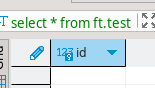

- [The problem](#the-problem)
- [The idea](#the-idea)
- [Building it](#building-it)
  - [Setting up the project](#setting-up-the-project)
  - [Setting up the database](#setting-up-the-database)
  - [Setting up database migrations](#setting-up-database-migrations)
  - [Building + running the app](#building--running-the-app)
  - [Running the tests](#running-the-tests)
  - [Setting up secrets](#setting-up-secrets)
  - [Planning the app's functionality](#planning-the-apps-functionality)
  - [Designing the database schema](#designing-the-database-schema)
  - [Designing the app flow](#designing-the-app-flow)
- [Conclusion](#conclusion)

## The problem

I am very interested in fitness, I go to the gym 4/5 times a week and really enjoy the tracking and progression aspects of it. To keep track of things, I use:
- **A spreadsheet**, here I log my lifts for each session, my maximum lifts, caloric intake and various other food-based calculations. 
- **MyFitnessPal**, for logging food eaten and my weight
- **Garmin Connect**, for logging health stats like daily sleep and resting heart rate.

Whilst this works OK, I rarely log my actual lifts at the gym itself, and end up doing it when I go home. Sometimes I end up forgetting to do this, and other times I misremember specific lifts I've done. I also miss out on one of my favourite things at the gym, logging the activity itself - it feels really good when you've hit a new weight/rep maximum and logging it.

## The idea

My idea is to create a fitness tracking app where I can log my lifts and weight, whilst using my other data sources (MyFitnessPal and Garmin Connect) to enrich this data. I can then see things like how my caloric intake and sleep affect my performance and various other (most likely useless) information.

In the past I have built something quite similar to this, but the project fizzled out when I got to the part where I had to build the UI for logging activities and actually hosting it on a server so I could use it in public.

For this project I have a few aims:
- Use the latest version of technologies I use at work (Java, Spring), and introduce some new ones.
- Gain more experience building React Native applications
- Build something that's actually useful for me and my day-to-day life

I'm fully aware that app exist that do these things (probably), but the goals are more focused on learning new things and having an interesting side project to work on, rather than building an app to make money, or solve problems for a large group of people. Similarly for different aspects of the app, I'm going to build almost everything from scratch (e.g. auth) rather than something off the shelf - I may change this approach if I start spending too long on those things.

## Building it

For part one, I'm going to focus on setting up the project and designing things, rather than going straight in and writing lots of code.

I have a general idea of how I'm going to approach this:
- Setting up the project, this includes things like the database migration process, running the tests and building/running the app locally.
- Plan the basic functionality the app will have in text form
- Design the database schema (I already have an old schema to work with, which needs a few modifications)
- Design a basic app flow, based on how I'd like to use it

### Setting up the project

Firstly we'll need the the Java 22 SDK for writing code, I got this by using `sdkman` and running this:

```bash
sdk install java 22.0.1-tem
```
...and made sure it was installed:

```
$ java -version
openjdk version "22.0.1" 2024-04-16
OpenJDK Runtime Environment Temurin-22.0.1+8 (build 22.0.1+8)
OpenJDK 64-Bit Server VM Temurin-22.0.1+8 (build 22.0.1+8, mixed mode, sharing)
```

Next we'll create our Spring project, using [Spring Initializr](https://start.spring.io), we'll add the following additional deps:
- Spring Web
- Spring Boot DevTools
- JOOQ (something I'd like to try for DB access)
- MySQL DB Driver

I might be missing some, but we can always add them later on. You can use [this link](https://start.spring.io/#!type=maven-project&language=java&platformVersion=3.3.1&packaging=jar&jvmVersion=22&groupId=com.dmoffat&artifactId=fitnesstracker&name=fitnesstracker&description=Fitness%20tracking%20application&packageName=com.dmoffat.fitnesstracker&dependencies=web,jooq,devtools,mysql) to see the exact configuration I chose.

I unzipped the downloaded ZIP file and filled in my `.gitignore`.

Now we have a fully functional Spring app (that doesn't even start, for the moment).

### Setting up the database

Before we can run our app, we need to set up a database. As mentioned in my previous blog posts, I use Docker to manage running different services on my local machine. Let's use Docker to create a MySQL instance. Because I'm planning on running multiple services on my computer (MySQL, Java app and a web server (reverse proxy)), I'll use Docker Compose to manage my Docker containers.

To use Docker Compose we'll need to create a `docker-compose.yml` config file. I used [the official reference](https://docs.docker.com/compose/compose-file/) to figure out how to write the config file (we use it at work for local dev, so I do have a general idea on the different elements).

It looks something like this:

```yaml
name: fitnesstracker
services:
  db: 
    image: mysql:8.0.38
    container_name: 'ft-mysql'
    ports:
      # Use a port different to the default so we don't have to stop any running MySQL databases
      - 3310:3306
    restart: always
    volumes:
      # Use a persistent data directory
      - ./db/data:/var/lib/mysql
    environment:
      # This is temporary so we can make sure things working, this won't be used for production.
      MYSQL_ROOT_PASSWORD: example
```

I read through the [offical MySQL docker image docs](https://hub.docker.com/_/mysql) to configure it. I decided to use `8.0.38` as that version is supported by the DB access library I want to use (JOOQ).

Next I started the app services (in this case, just the DB) to make sure it works:

```
$ docker compose up -d
[+] Running 2/2
 ✔ Network fitnesstracker_default  Created                                                                                                                                                                                             0.1s 
 ✔ Container ft-mysql              Started 
```

I then made sure I could connect to the database using the `mysql` CLI:

```
$ mysql -h 172.21.0.2 -u root -p
Enter password: 
Welcome to the MySQL monitor.  Commands end with ; or \g.
Your MySQL connection id is 11
Server version: 8.0.38 MySQL Community Server - GPL

Copyright (c) 2000, 2024, Oracle and/or its affiliates.

Oracle is a registered trademark of Oracle Corporation and/or its
affiliates. Other names may be trademarks of their respective
owners.

Type 'help;' or '\h' for help. Type '\c' to clear the current input statement.

mysql> select User from mysql.user;
+------------------+
| User             |
+------------------+
| root             |
| mysql.infoschema |
| mysql.session    |
| mysql.sys        |
| root             |
+------------------+
5 rows in set (0.00 sec)

mysql> 
```

Now that the database is running, we'll need to update our Java app to connect to it.

> **Side note**: For now, I'm using the root DB user in my app, and I've put the database password in plain text in the repo. I've done this to make sure DB connectivity works. In the future, I'll create a different user, and remove sensitive credentials from the repo. I KNOW THIS IS WRONG/BAD PRACTICE.

I added the following to `application.properties`:

```properties
spring.datasource.url=jdbc:mysql://<db_host>
spring.datasource.username=<db_user>
spring.datasource.password=<db_password>
spring.datasource.driver-class-name=com.mysql.cj.jdbc.Driver
spring.jpa.show-sql=true
```

I then started my app (through the IDE) and made sure it connected to the database.

### Setting up database migrations

At work we use a homegrown migration system which runs Groovy scripts. For this project I'm going to use Flyway, a Java-based database migration tool that handles migrations with plain SQL. I wanted to use something that's a bit more standardised and could be used on multiple projects.

To install, I downloaded their Docker container like this:

```bash
docker pull redgate/flyway:10.15.2-alpine
```
I chose this method as it makes it easier to manage on multiple systems without needing to install it separately on each.

Then to run it:

```bash
docker run --rm redgate/flyway:10.15.2-alpine
```

It works, but we need to make the migrations and configuration file visible:

```bash
docker run --rm \
  -v ./db/migrations:/flyway/sql \
  -v ./db/flyway.conf:/flyway/conf/flyway.conf \
  redgate/flyway:10.15.2-alpine
```

This fails, as the Flyway container cannot "see" the database container. There are a few ways we can get around this:
1. Use a fixed IP for the DB container, and use that in the Flyway config file.
2. Give the db container a `hostname` and add a Flyway container to `docker-compose.yml`, then reference the hostname in our config file. When we start the Flyway container, the `db` containers IP will be added to `/etc/hosts` with the hostname we specified.

I went with #2, so we can references containers from other containers with a name, instead of a fixed IP.

I added the following to `docker-compose.yml`:

```yaml
migrations:
  image: redgate/flyway:10.15.2-alpine
  container_name: migrations
  command: 'migrate'
  volumes:
    - ./db/flyway.conf:/flyway/conf/flyway.conf
    - ./db/migrations:/flyway/sql
```

Then ran it using `docker compose up migrations` which gave the following output:

```
$ docker compose up migrations 
[+] Building 0.0s (0/0)                                                                                                      
[+] Running 1/0
 ✔ Container migrations  Created                                                                                        0.0s 
Attaching to migrations
migrations  | Flyway Community Edition 10.15.2 by Redgate
migrations  | 
migrations  | See release notes here: https://rd.gt/416ObMi
migrations  | Database: jdbc:mysql://db:3306 (MySQL 8.0)
migrations  | ERROR: Unable to determine schema for the schema history table. Set a default schema for the connection or specify one using the 'defaultSchema' property
```
This means it's working, just that there isn't a schema defined for it to create a migrations table.

We're going to modify our `db` container definition slightly so that it creates a schema when the database it initialised for the first time:

```yaml
environment:
  MYSQL_DATABASE: ft
```

Because our database is already initialised, we'll need to delete our data directory (`db/data/`) and recreate the database with `docker compose up -d db`. We'll also create script named `delete-db` which performs these steps incase we have to do it again in the future.

Then, update our `flyway.conf` to include the database in the connection string like:

```
flyway.url=jdbc:mysql://db:3306/ft
```

Running `docker compose up migrations` now produces a different error:

```
$ ./migrate
[+] Building 0.0s (0/0)                                                                                                      
[+] Running 1/0
 ✔ Container migrations  Created                                                                                        0.0s 
Attaching to migrations
migrations  | Flyway Community Edition 10.15.2 by Redgate
migrations  | 
migrations  | See release notes here: https://rd.gt/416ObMi
migrations  | ERROR: Unable to obtain connection from database (jdbc:mysql://db:3306/ft) for user 'root': Could not connect to address=(host=db)(port=3306)(type=master) : RSA public key is not available client side (option serverRsaPublicKeyFile not set)
migrations  | -----------------------------------------------------------------------------------------------------------------------------------------------------------------------------------------------------------------------------------------
migrations  | SQL State  : S1009
migrations  | Error Code : 0
migrations  | Message    : Could not connect to address=(host=db)(port=3306)(type=master) : RSA public key is not available client side (option serverRsaPublicKeyFile not set)
migrations  | 
migrations  | Caused by: java.sql.SQLTransientConnectionException: Could not connect to address=(host=db)(port=3306)(type=master) : RSA public key is not available client side (option serverRsaPublicKeyFile not set)
migrations  | Caused by: java.sql.SQLException: RSA public key is not available client side (option serverRsaPublicKeyFile not set)
migrations exited with code 1
```

Without looking too deeply into this, we can suppress the error by adding the following to our `db` service in `docker-compose.yml`:

```
command: --default-authentication-plugin=mysql_native_password
```

Because this is a development db, we're not really concerned with security at this point.

Now all of that's out the way, running `./migrate` produces: 

```
$ ./migrate
[+] Building 0.0s (0/0)                                                                                                      
[+] Running 1/0
 ✔ Container migrations  Created                                                                                        0.0s 
Attaching to migrations
migrations  | Flyway Community Edition 10.15.2 by Redgate
migrations  | 
migrations  | See release notes here: https://rd.gt/416ObMi
migrations  | Database: jdbc:mysql://db:3306/ft (MySQL 8.0)
migrations  | Schema history table `ft`.`flyway_schema_history` does not exist yet
migrations  | Successfully validated 0 migrations (execution time 00:00.011s)
migrations  | WARNING: No migrations found. Are your locations set up correctly?
migrations  | Creating Schema History table `ft`.`flyway_schema_history` ...
migrations  | Current version of schema `ft`: << Empty Schema >>
migrations  | Schema `ft` is up to date. No migration necessary.
migrations  | 
migrations  | You are not signed in to Flyway, to sign in please run auth
migrations exited with code 0
```

After installing it, I wrote my first migration (`V1__test-migration.sql`) and ran it:

```
$ ./migrate
[+] Building 0.0s (0/0)                                                                                                      
[+] Running 1/0
 ✔ Container migrations  Created                                                                                        0.0s 
Attaching to migrations
migrations  | WARNING: Storing migrations in 'sql' is not recommended and default scanning of this location may be deprecated in a future release
migrations  | Flyway Community Edition 10.15.2 by Redgate
migrations  | 
migrations  | See release notes here: https://rd.gt/416ObMi
migrations  | Database: jdbc:mysql://db:3306/ft (MySQL 8.0)
migrations  | Successfully validated 1 migration (execution time 00:00.026s)
migrations  | Current version of schema `ft`: << Empty Schema >>
migrations  | Migrating schema `ft` to version "1 - test-migration"
migrations  | Successfully applied 1 migration to schema `ft`, now at version v1 (execution time 00:00.078s)
migrations  | 
migrations  | You are not signed in to Flyway, to sign in please run auth
migrations exited with code 0

```

We can see it was applied successfully, and we double-checked by looking in our DB client:




So now we have a dev database, and a migration system working.

### Building + running the app

Now all of the database stuff is working, we need to build and run the app.

For production, we're going to want to package the app up into a Docker container and have it running behind something like nginx.

For development, we can get away with running the app directly through our IDE, this has the advantage of being able to utilise [Spring Boot DevTools features](https://docs.spring.io/spring-boot/docs/1.5.16.RELEASE/reference/html/using-boot-devtools.html#using-boot-devtools-restart) (e.g. automatic restart on code change) and just being quicker in general.

This will work just fine as we're developing the app. Once we have something that's usable, we'll look at making our app production-ready. I should probably do this at the begininning, rather than trying to retrofit it into an existing application, but I'm really motivated at the moment to start building things.

Running the app through the IDE is really simple, Ctrl+Shift+F10 inside the main `@SpringBootApplication` class and you get greeted with the following:

```
/home/dan/.sdkman/candidates/java/22.0.1-tem/bin/java ... com.dmoffat.fitnesstracker.FitnesstrackerApplication

  .   ____          _            __ _ _
 /\\ / ___'_ __ _ _(_)_ __  __ _ \ \ \ \
( ( )\___ | '_ | '_| | '_ \/ _` | \ \ \ \
 \\/  ___)| |_)| | | | | || (_| |  ) ) ) )
  '  |____| .__|_| |_|_| |_\__, | / / / /
 =========|_|==============|___/=/_/_/_/

 :: Spring Boot ::                (v3.3.1)

2024-07-07T10:33:06.328+01:00  INFO 20533 --- [fitnesstracker] [  restartedMain] c.d.f.FitnesstrackerApplication          : Starting FitnesstrackerApplication using Java 22.0.1 with PID 20533 (/home/dan/dev/fitness-tracker-app/server/target/classes started by dan in /home/dan/dev/fitness-tracker-app)
2024-07-07T10:33:06.335+01:00  INFO 20533 --- [fitnesstracker] [  restartedMain] c.d.f.FitnesstrackerApplication          : No active profile set, falling back to 1 default profile: "default"
2024-07-07T10:33:06.409+01:00  INFO 20533 --- [fitnesstracker] [  restartedMain] .e.DevToolsPropertyDefaultsPostProcessor : Devtools property defaults active! Set 'spring.devtools.add-properties' to 'false' to disable
2024-07-07T10:33:06.410+01:00  INFO 20533 --- [fitnesstracker] [  restartedMain] .e.DevToolsPropertyDefaultsPostProcessor : For additional web related logging consider setting the 'logging.level.web' property to 'DEBUG'
2024-07-07T10:33:08.025+01:00  INFO 20533 --- [fitnesstracker] [  restartedMain] o.s.b.w.embedded.tomcat.TomcatWebServer  : Tomcat initialized with port 8080 (http)
2024-07-07T10:33:08.034+01:00  INFO 20533 --- [fitnesstracker] [  restartedMain] o.apache.catalina.core.StandardService   : Starting service [Tomcat]
2024-07-07T10:33:08.034+01:00  INFO 20533 --- [fitnesstracker] [  restartedMain] o.apache.catalina.core.StandardEngine    : Starting Servlet engine: [Apache Tomcat/10.1.25]
2024-07-07T10:33:08.060+01:00  INFO 20533 --- [fitnesstracker] [  restartedMain] o.a.c.c.C.[Tomcat].[localhost].[/]       : Initializing Spring embedded WebApplicationContext
2024-07-07T10:33:08.061+01:00  INFO 20533 --- [fitnesstracker] [  restartedMain] w.s.c.ServletWebServerApplicationContext : Root WebApplicationContext: initialization completed in 1650 ms
2024-07-07T10:33:08.456+01:00  INFO 20533 --- [fitnesstracker] [  restartedMain] com.zaxxer.hikari.HikariDataSource       : HikariPool-1 - Starting...
2024-07-07T10:33:08.743+01:00  INFO 20533 --- [fitnesstracker] [  restartedMain] com.zaxxer.hikari.pool.HikariPool        : HikariPool-1 - Added connection com.mysql.cj.jdbc.ConnectionImpl@72a1f560
2024-07-07T10:33:08.745+01:00  INFO 20533 --- [fitnesstracker] [  restartedMain] com.zaxxer.hikari.HikariDataSource       : HikariPool-1 - Start completed.
2024-07-07T10:33:09.326+01:00  INFO 20533 --- [fitnesstracker] [  restartedMain] o.s.b.d.a.OptionalLiveReloadServer       : LiveReload server is running on port 35729
2024-07-07T10:33:09.400+01:00  INFO 20533 --- [fitnesstracker] [  restartedMain] o.s.b.w.embedded.tomcat.TomcatWebServer  : Tomcat started on port 8080 (http) with context path '/'
2024-07-07T10:33:09.408+01:00  INFO 20533 --- [fitnesstracker] [  restartedMain] c.d.f.FitnesstrackerApplication          : Started FitnesstrackerApplication in 3.529 seconds (process running for 4.057)
```

### Running the tests

Running the tests in a Spring Boot app is no different than running your tests for any Maven project:

```bash
./mvnw test
```

This produces:

```
[INFO] Tests run: 1, Failures: 0, Errors: 0, Skipped: 0, Time elapsed: 3.017 s -- in com.dmoffat.fitnesstracker.FitnesstrackerApplicationTests
[INFO] 
[INFO] Results:
[INFO] 
[INFO] Tests run: 1, Failures: 0, Errors: 0, Skipped: 0
[INFO] 
[INFO] ------------------------------------------------------------------------
[INFO] BUILD SUCCESS
[INFO] ------------------------------------------------------------------------
[INFO] Total time:  6.274 s
[INFO] Finished at: 2024-07-07T10:37:00+01:00
[INFO] ------------------------------------------------------------------------
```

This will be useful when we need to write a script which builds + tests the app.

### Setting up secrets

In previous steps, we've added the secrets in plain-text to the repository which is bad.

At work we use AWS Systems Manager Parameter Store to manage secrets. For this project, I'm going to manage secrets myself using an `.env` file.

First let's create a template file containing all of the variables we'll need:

```bash
# Spring app
DB_HOST=
DB_USER=
DB_PASSWORD=

# MySQL container
MYSQL_ROOT_PASSWORD=
MYSQL_USER=
MYSQL_PASSWORD=

# Flyway config
FLYWAY_URL=
FLYWAY_USER=
FLYWAY_PASSWORD=
```

Then let's copy this into `.env` and fill in the variables, then add it to `.gitignore`.

There are three places where we need to remove the plain-text values, and replace with values from our `.env` file:
- App config (`application.properties`)
- Flyway config (`flyway.conf`)
- DB service config (`docker-compose.yml`)

The app config now looks like:

```properties
spring.datasource.url=jdbc:mysql://${DB_HOST}/
spring.datasource.username=${DB_USER}
spring.datasource.password=${DB_PASSWORD}
```

For Flyway, I removed `flyway.conf`, and added the following to `docker-compose.yml`:

```yaml
services:
  migrations:
    # ...
    env_file:
      - './.env'
    # ...
```

And added something similar for our DB config:

```yaml
services:
  db:
    # ...
    env_file:
      - './.env'
    # ...
```

Once I changed these, I made sure everything still works by recreating the DB service, running the app and performing a migration.

### Planning the app's functionality

At a basic level, the app needs to allow me to do the following:
- Register and log in
- Track my weight each day
- Track my workouts by recording:
  - The date and time of my workout
  - The weight lifted
  - The number of sets
  - The number of repetitions
  - The name of the exercise
  - The type of exercise (e.g. freeweight vs machine)
  - Any equipment used (e.g. weightlifting belt, straps, resistance bands, etc)
  - If a machine exercise, the brand/model of the machine
  - Notes for individual set
  - Notes for the workout as a whole

This is the core functionality, other things can be added afterwards.

### Designing the database schema

I've already created a database schema for an app extremely similar to this, but it had some issues and it doesn't fulfil the functionality mentioned above.

> **Side note:** this won't be the final design, we'll almost certainly add/remove columns as I go along, and when we get that far, I'll look at adding indexes and other DB optimisations.

First let's start with a simple `user` table to store our users:

```sql
create table ft.user (
    id int unsigned auto_increment,
    email varchar(50) not null,
    `password` varchar(255) not null,
    created_on timestamp default current_timestamp,
    updated_on timestamp default current_timestamp on update current_timestamp,
    primary key(id),
    unique (email)
);
```

This fulfils the following functionality:
- Register and log in

Next, we'll need a table to store our weight:

```sql
create table ft.body_weight (
    id int unsigned auto_increment,
    user_id int unsigned not null,
    logged_on date default current_date,
    primary key(id),
    foreign key(user_id) references ft.user(id)
);
```

Each row has an associated user, so we can track weight for each user.

This fulfils the following functionality:
- Tracking my weight each day

Next, we'll need a table to store our workouts:

```sql
create table ft.workout (
    id int unsigned auto_increment,
    user_id int unsigned not null,
    notes text null,
    started_on datetime not null,
    finished_on datetime null,
    created_on timestamp default current_timestamp,
    updated_on timestamp default current_timestamp on update current_timestamp,
    primary key(id),
    foreign key(user_id) references ft.user(id)
);
```

Each row has an associated user, so we can list workouts by user, amongst other things.

This fulfils the following functionality:
- Recording the date and time of the workout
- Recording notes for the workout as a whole

Next, we'll need a reference table to store exercises:

```sql
create table ft.exercise (
    id int unsigned auto_increment,
    `name` text not null,
    brand text null,
    `type` varchar(20) not null default 'FREE_WEIGHT',
    primary key(id)
);
```

Some examples:
- A free weight backsquat would be stored as `('Barbell Back Squat', null, 'FREE_WEIGHT')`
- A machine bench press would be stored as `('Bench press', 'Matrix', 'MACHINE')`

This fulfils the following functionality:
- Record the name of the exercise
- Record the type of the exercise
- Record the brand of the machine

We use an auto incrementing ID - we could use a composite primary key, as `name`, `brand` and `type` uniquely identify each exercise, but it would mean any referencing tables would need to join on all three columns, which is messy.

Finally, we'll need a table to record the exercises performed during the workout:

```sql
create table ft.workout_exercise (
    id int unsigned auto_increment,
    workout_id int unsigned not null,
    exercise_id int unsigned not null,
    `weight` int unsigned not null default 1,
    `sets` int not null default 1,
    reps int not null default 0,
    notes text null,
    equipment json default null,
    created_on timestamp default current_timestamp,
    updated_on timestamp default current_timestamp on update current_timestamp,
    primary key(id),
    foreign key(workout_id) references ft.workout(id),
    foreign key(exercise_id) references ft.exercise(id)
);
```

Each row has an associated workout and exercise. The primary key is an auto incrementing ID, as you may perform various configurations of weight/sets/reps for a specific exercise, for example, you may perform (sets x reps):
- 3 x 5 @ 100KG
- 2 x 10 @ 80KG

This fulfils the following functionality:
- Recording the number of sets/reps
- Recording the weight
- Notes for an individual set

That's it - the structure is fairly simple and fulfils all of the functionality I outlined at the beginning. I added the SQL to some migrations and ran them using `./migrate`:

```
$ ./migrate 
[+] Building 0.0s (0/0)                                                                                                      
[+] Running 1/0
 ✔ Container migrations  Created                                                                                        0.0s 
Attaching to migrations
migrations  | WARNING: Storing migrations in 'sql' is not recommended and default scanning of this location may be deprecated in a future release
migrations  | Flyway Community Edition 10.15.2 by Redgate
migrations  | 
migrations  | See release notes here: https://rd.gt/416ObMi
migrations  | Database: jdbc:mysql://db:3306/ft (MySQL 8.0)
migrations  | Schema history table `ft`.`flyway_schema_history` does not exist yet
migrations  | Successfully validated 2 migrations (execution time 00:00.017s)
migrations  | Creating Schema History table `ft`.`flyway_schema_history` ...
migrations  | Current version of schema `ft`: << Empty Schema >>
migrations  | Migrating schema `ft` to version "1 - create user table"
migrations  | Migrating schema `ft` to version "2 - create exercise tables"
migrations  | Successfully applied 2 migrations to schema `ft`, now at version v2 (execution time 00:00.519s)
migrations  | 
migrations  | You are not signed in to Flyway, to sign in please run auth
migrations exited with code 0

```

At this stage I also like to try and write some queries to see how using the tables is like, for example:
- List the total volume of weight for a given exercise in a workout
- Get the maximum weight lifted for a specific exercise

### Designing the app flow

The app flow will dictate what APIs I need to build. I like to do it in text format rather than start prototyping straight away.

The flow will look like:
- User will be shown the **splash screen**
- User will land on the **login screen**
    - If the user has an account, they will authenticate using an email/password
    - If the user does not have an account, they will create one on the **register screen**
- After authenticating, the user will be sent to the **dashboard screen**
- From the **dashboard screen**, the user can:
  - Start a new workout, which takes them to the **new workout screen**, on this screen:
    - User will start their workout
    - User will add a exercise, along with sets and reps performed
    - After adding all the exercises, user will enter some notes and end the workout
  - Log their weight for today, which takes them to the **log weight screen** on this screen:
    - User will enter their weight

I think that's it for now, it fulfils all of the functionality I spoke about before.

## Conclusion

We've got a lot accomplished so far, we've created a database service (with migrations), a basic Java app, designed the database structure and got an intial idea of the app's flow.

In the next part we'll start building our backend API with Java.

[Bye for now](https://www.youtube.com/watch?v=JgFvNzLAWtY)
