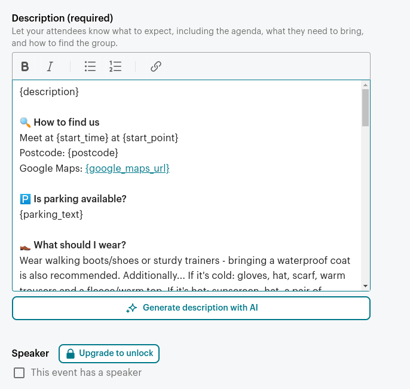

- [Introduction](#introduction)
- [The problem](#the-problem)
- [The ideal solution](#the-ideal-solution)
- [My solution](#my-solution)
- [Building](#building)
  - [Getting started](#getting-started)
  - [Extracting the data from the website](#extracting-the-data-from-the-website)
  - [Combining walk data with templates](#combining-walk-data-with-templates)
  - [Making the template dynamic](#making-the-template-dynamic)
  - [Making sure it pastes correctly](#making-sure-it-pastes-correctly)
  - [Mapping template variables to walk data](#mapping-template-variables-to-walk-data)
  - [Merging template model with the template](#merging-template-model-with-the-template)
  - [Creating the HTML pages](#creating-the-html-pages)
  - [Copying the text automatically](#copying-the-text-automatically)
- [Future enhancements](#future-enhancements)
- [Source code](#source-code)


## Introduction

I used to regularly walk with a Rambler's walking group named West Midlands Walking Group (aka. WMWG). After walking with them for several months, I decided I would contribute something back (it's ran by volunteers) and help them advertise walks online.

## The problem

One of my responsibilities involved posting walks to [Meetup](https://www.meetup.com) 4 times a year, the process for this looked something like the following:
- Go to the [WMWG website](https://www.wmwg.org.uk)
- Go to the walks section
- For each walk on the list...
  - Copy the walk name into the title field on Meetup
  - Copy the description/additional notes into a description field on Meetup, tweaking various bits depending on the content (for example, if the description mentioned parking, copy that information into the parking section)
  - Fix any typos/reword anything that doesn't read well
  - Set the start/end date/time
  - Copy the postcode and post it into the postcode field and position the map pin on Google Maps.
  - Click the "Email walk contact" link and copy that link into the contact field
  - Click the "Google Directions" link and copy that link into the Google Maps link field
  - ...lots more manual stuff

To boil it down, it was a lot of manual, repetitive work that I found more and more tedious each time I had to do it. I found myself double-checking everything to make sure I'd copied it properly and made quite a lot of mistakes. It would take 3+ hours each time I had to do it.

## The ideal solution

In an ideal world, Meetup would have an API to post events and The Rambler's would have an API to retrieve walk data for the group. I could then write a simple program to read events from one API, and post them with another.

So here's the thing, The Ramber's DO have an API (that you have to request access to) and Meetup DO have an API! ...but it costs £100~ per year to access, which is not feasible to use.

## My solution

My solution involves reading the walks directly from the WMWG website, then generating some text from a template that I can paste directly into Meetup's UI. It doesn't completely eliminate manual work, and will still require some manual editing of the text, but removes all of the thinking I have to do.

To make pasting the text easier, I'll create a HTML page which has clickable buttons to copy the text for each template.

Is it worth it? Probably not, but I wanted to make it as easy as possible to do.

## Building

I program day-to-day in Java, but I don't think it's very well suited to ad-hoc scripting compared to something like JavaScript, so I decided to write it in JavaScript, and use [Deno](https://deno.com/) as the runtime.

I've wanted to try Deno for a while, it's nice being able to write TypeScript without a compilation step, and even nicer being able to import dependencies without using `npm`/`yarn`/whatever.

### Getting started

First I created a `main.ts` file with a simple `console.log`, then ran it using:

```bash
deno run main.ts
# Outputs: 'Hello world!'
```

Now we can write code that does something.

### Extracting the data from the website

The website is an old PHP website (using Joomla) and doesn't have an API. The data for the page lives inside a `<script>` tag in a JavaScript variable (...nice!), then JavaScript is used to populate a modal using that data when you select a walk:


Getting the data was simple enough:
- Fetch the page content using `fetch`
- Parse the HTML into a `Document` to make extracting `script` elements easier
- Write a regular expression to extract the variable out

My function looked something like this:

```ts
import { DOMParser } from "https://deno.land/x/deno_dom@v0.1.47/deno-dom-wasm.ts";

/**
 * This function extracts walk data from a WMWG walking page. 
 * 
 * The data is inside a variable named 'data' in a <script> tag, it looks like this:
 * 
 * <script>
 * window.addEventListener('load', function() {
 *      var mapOptions = {};
 *      var data = '{\"walks\": []}'
 * });
 * 
 * window.addEventListener('load', function() {
 *      var mapOptions = {...};
 *      var data = '{\"walks\": [{\"admin\": ...rest of data ... }]}'
 * });
 * </script>
 * 
 * The first event handler contains the same variables, they just don't have any data in, we're looking specifically for the 
 * second 'data' definition.
 * 
 * ...yep, it's crap, but that's the only place to fetch this data from.
 * 
 * @param walkPageUrl The page to extract walk data from
 * @returns An array of walks
 */

export default async function extractWalkData(walkPageUrl: string): Promise<Array<Walk>> {
    console.log('Extracting walk data from: ' + walkPageUrl);

    const resp = await fetch(walkPageUrl);
    const html = await resp.text();
    const document = new DOMParser().parseFromString(html, 'text/html');

    // Find the <script> tag with the 'data' variable in
    const [ script ] = Array.from(document.querySelectorAll('script')).filter(script => {
        return script.innerHTML.includes(`var data=`);
    });

    if(!script) {
        console.log('Failed to find <script> with "var data=" in - the page HTML may have changed.');
        Deno.exit(1);
    }

    // Find the 'data' variable which has data in, there are multiple 'data' variables in this script block, but only one of them has data in.
    // The real one looks like {walks: [{ ... some data ...}]}
    // The empty one looks like {walks: []}
    const jsonRegex = /'{\\"walks\\":\[{\\"admin.+'/gm;
    const [ match ] = script.innerHTML.match(jsonRegex);

    // Now we have the data, it looks like this:
    // '{\"fieldName\": \"fieldValue\"}'
    const jsonStr = match
        // Remove single quotes from either side
        .substr(1, match.length - 2)
        // Unescape the double quotes
        .replaceAll("\\\"", "\"")
        // Unescape the single quotes
        .replaceAll("\\\'", "\'")
        // Unescape the forward slashes
        .replaceAll("\\\\", "");

    // Finally! We have our data
    const { walks } = JSON.parse(jsonStr);

    return walks;
}
```

It's a bit messy, but that's just how the data is stored on the page, so there's nothing I can do about it.

One issue I had with Deno is that you have to explicitly allow network access when running your script (`fetch` uses the network):

```bash
deno run --allow-net main.ts
```

And the output:

```
$ deno run --allow-net main.ts 
Extracting walk data from: https://www.wmwg.org.uk/walks.html
Found 16 walks.
```

### Combining walk data with templates

Now we have a list of walks, we need to combine them with our Meetup template, our template looks something like this:

```html
<p>Walk description goes here</p>

<strong>🔍 How to find us</strong>
<p>Meet at 10:30 at Dover's Hill Car Park</p>
<p>Postcode: <strong>GL55 6UN</strong></p>
<p>Google Maps: <a href="https://www.google.com/maps/dir/Current+Location/52.052817,-1.801972">https://www.google.com/maps/dir/Current+Location/52.052817,-1.801972</a>
```

> **Side note** the template is HTML because the input field on Meetup's website is a rich text editor, so in order to retain formatting and links, we need to copy/paste HTML, rather than plain text.

Roughly, the process will involve:
- Reading a template file
- Replacing certain bits depending on the value of certain walk properties, for example:
  - If a walk's grade is "strenuous", a warning is added that the walk may not be suitable for everyone.
  - If a walk's length is less than 3 hours, the part about bringing a packed lunch is removed
  - ...and so on.
- Writing the finished template out to a HTML file with buttons to copy the text for each walk.

### Making the template dynamic

First we'll need to edit our template, and replace all the dynamic parts with our template tags, in this case I'm going to use `{curly_braces_with_lowercase_name}`:

```html
<p>{description}</p>

<strong>🔍 How to find us</strong>
<p>Meet at {start_time} at {start_point}</p>
<p>Postcode: <strong>{postcode}</strong></p>
<p>Google Maps: <a href="{google_maps_url}">{google_maps_url}</a>

<!-- Rest of template ... ->
```

### Making sure it pastes correctly

Meetup has a rich-text editor which means when you paste formatted text (e.g. bold, italic, links, etc), it retains the formatting. If you paste HTML, it pastes it literally.

After modifying the template, I pasted it into Meetup to make sure it rendered correctly:



I noticed that the input didn't respect paragraphs, so I had to add a bunch of `<br>` tags to force a new line. This took a little bit of back and forth, but eventually I managed to get the formatting matching the original.

### Mapping template variables to walk data

Now we have a list of variables we need to substitute, we'll need to see how those map to the walk data we extracted previously.

To get a list of variables from our template that we need to map, we can search the file using a regular expression search in VSCode `\{.+?\}`, then use CTRL + SHIFT + L to select them all, this produces the following:

```
{description}
{start_time}
{start_point}
{postcode}
{google_maps_url}
{parking_text}
{food_text}
{walk_difficulty_text}
{dog_text}
{ramblers_contact_url}
```

Next we need to write a mapping function that takes a `Walk` and maps it to a `TemplateModel`:

```ts
import { Walk } from "./extract-walk-data"

export type TemplateModel = {
    description: string,
    start_time: string,
    start_point: string,
    postcode: string,
    google_maps_url: string,
    parking_text: string,
    food_text: string,
    walk_difficulty_text: string,
    dog_text: string,
    ramblers_contact_url: string
}

export default function mapWalkToTemplateModel(walk: Walk): TemplateModel {
    // todo
    return {
        description: '',
        start_time: '',
        start_point: '',
        postcode: '',
        google_maps_url: '',
        parking_text: '',
        food_text: '',
        walk_difficulty_text: '',
        dog_text: '',
        ramblers_contact_url: ''
    }
}
```

After a little while I managed to map everything, along with coming to the realisation that the data is not perfect, and some manual editing will be required - for example some leaders don't let you know what dogs are welcome, or they do, but they put it in a non-standard field, making it difficult to figure out.

### Merging template model with the template

Now we have the model data, and the template, we need to merge them together. We use a primitive method (good ol' `replaceAll` for each property in our model) to create it. Remember - this is a throwaway tool, and there's at most 20 walks to process.

The code looks like this:

```ts
import { TemplateModel } from "./map-walk-to-template-model.ts";

export type MergedTemplate = {
    model: TemplateModel,
    html: string
}

export default function mergeModelWithTemplate(templateHtml: string, model: TemplateModel): MergedTemplate {
    let html = templateHtml;

    for (const [key, value] of Object.entries(model)) {
        html = html.replaceAll(`{${key}}`, value);
    }

    return {
        model: model,
        html: html
    }
}
```

### Creating the HTML pages

Now we've created everything, let's update `main.ts` to include these new functions, and actually save the merged template to HTML files:

```ts
const walks = await extractWalkData('https://www.wmwg.org.uk/walks.html');
console.log(`Found ${walks.length} walks.`);

const templateHtml = await Deno.readTextFile('./template.html');

walks.forEach(async walk => {
    const templateModel = mapWalkToTemplateModel(walk);
    const template = mergeModelWithTemplate(templateHtml, templateModel);
    const outputPath = `./output/${template.model.title}.html`;
    
    await Deno.writeFile(outputPath, new TextEncoder().encode(template.html));
});
```

The end result is the `output` folder containing a bunch of HTML files, here's an example of one:


We're almost there now, all that's left to do is add some more things to the template that need to be filled in.

### Copying the text automatically

I know you can copy text programatically with JavaScript, so I wanted to see if I could add this functionality to my template files.

todo:


## Future enhancements

I could write a browser extension which would let you select a walk, then attempt to fill in all the inputs on the page, instead of having to copy/paste them myself, maybe that's something I'll do at a later date...

## Source code

You can find the full source code [on my GitHub](https://github.com/danmofo/wmwg-meetup-event-generator)

Bye for now.
