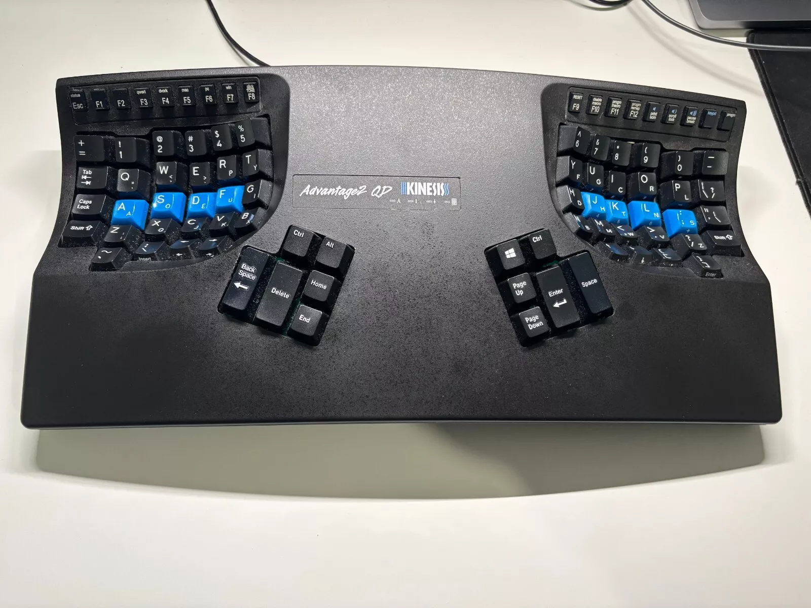

- [Introduction](#introduction)
- [Switching keyboards](#switching-keyboards)
- [Introducing a window manager](#introducing-a-window-manager)
- [Conclusion](#conclusion)

## Introduction

As a programmer, or even someone that uses a computer daily, I think it's important to have an efficient workflow so that your focus when performing a task is solely on the task at hand, rather than how you're operating the 
computer (keys you press, switching between programs, etc.)

I'd say I'm about 80% of the way there for this:
- I can touch type at a reasonable speed (100+ WPM)
- I have keybindings for switching between my most used programs
- I can edit text pretty quickly

However there have always been things which irritate me, that I've just put up with, either out of being overly stubborn, or plain laziness:
- Switching between > 4 programs
- Using suboptimal key bindings
- Being inaccurate/slow at typing numbers/some symbols
- Wrist/elbow pain and discomfort
- Having to use the mouse for certain actions which I either don't know the keybinding for, or one doesn't exist

I'd say the main reason for not addressing these things is time - changing something in your muscle memory can take some time getting used to and my employer probably wouldn't react kindly to my output being reduced by 50% as I adapt to these changes. However I have 2 weeks off work, so I thought I'd dedicate some time to getting over the initial hurdles so that I can at least complete tasks by the time I go back.

## Switching keyboards

Whilst I'm pretty competent at using a keyboard, I wouldn't say it's a comfortable experience, especially whilst working several hours in a row. Over the years I've always had some degree of wrist/elbow discomfort/pain, 
but more recently this has become even more painful and I realised that it's something that isn't going to get better without some drastic interventions on my part - my main focus shall be on ergonomics.

I use keybindings for everything, many of those involve contorting my wrist in a certain way, causing ulnar deviation and/or excessive wrist extension. I didn't pick them for how comfortable they were, rather I picked 
them because they were the default in the programs I use. Another problem is my touch typing, whilst I would say I touch type "correctly" for 90% of actions, I still have some bad habits:
- Pressing combinations of CTRL/Shift/Alt/Meta key with the same hand 
- Using left Shift as the sole Shift modifier
- Using the wrong fingers for numbers and symbols
 
I bought an [Advantage Kinesis 2](https://kinesis-ergo.com/shop/advantage2/?srsltid=AfmBOoqDqbn7c_vC3XzXDGr4yYKX7szId53Gh4c3PkJ77eQR4GR8qrER) about 5/6 years ago and never bothered to learn to use it - so now I'm going to take the time to do so. Check out how strange the layout looks:

I've used it for about 10 hours in total so far and would say for general writing I'm about 80% of my original speed, and for code/text editing I'm still around 30% - most of my time has been spent on [Typeracer](https://www.typeracer.com) 
learning to touch type using the concave keyboard. Modifier keys have been moved to the thumb area, symbols (`{}[]`) have changed sides, and everything right of the main section of the keyboard has been moved into the thumb area - it has been quite challenging to learn, you really have to think before you type something.

I'm also making a conscious effort to use the "correct" fingers for the keys I'm pressing, changing keybindings which are uncomfortable and trying to use the keyboard as much as possible.

## Introducing a window manager

I use KDE Plasma as my desktop environment, my dev workflow involves pinning my development apps to the task bar, and using Alt+number to switch between them. This works quite well for 1-3 apps, but once you start stretching towards 5-6 it can be really uncomfortable. It's also not very good when you have multiple instances of the same app open, as you have to press the keybinding again to cycle between them - this can be alleviated to some extent if the app supports tabs, but then you have to learn another set of keybindings to change between tabs (which surprise surprise, differs between apps....).

I chose to use [i3](https://i3wm.org/) for no specific reason other than I'd heard of it a lot online, and looking at the website it seems easy to use and has a lot of documentation. I didn't want to fully change to a wm, and found a way to replace KDE's KWin with i3 so that I still had a start menu and way to point and click the mouse if needed.

Getting used to this was not that difficult, I could emulate my previous workflow with better support for multiple instances of apps. Here's the method I use:
- Assign each app/task to a workspace
- Use Alt+number to change between them
- Use the default keybindings to move apps between them/navigate between apps in the same workspace
- I wrote a script which opens all of my apps and assigns them to a specific workspace

With this method I can start my computer, run my script to open everything, then press Alt+number to go the app I want to use. I'm still getting used to this workflow, mainly because the Alt key is in a different location on my new keyboard, but can already see the benefits of having a consistent way to manage workspaces and apps.

## Conclusion

Making these changes has been a very frustrating experience, in some aspects it almost feels like you're starting again and the urge to connect an old keyboard or use a mouse at times is overwhelming.

On the other hand, as I get more familiar with the keyboard and workflow, it feels very rewarding to do things so smoothly.

In the future I'd like to look at learning vim for general text editing as I feel like that's my weakest area at the moment, but that's probably something for next year....:) Learning that at the same time as this would be masochistic.